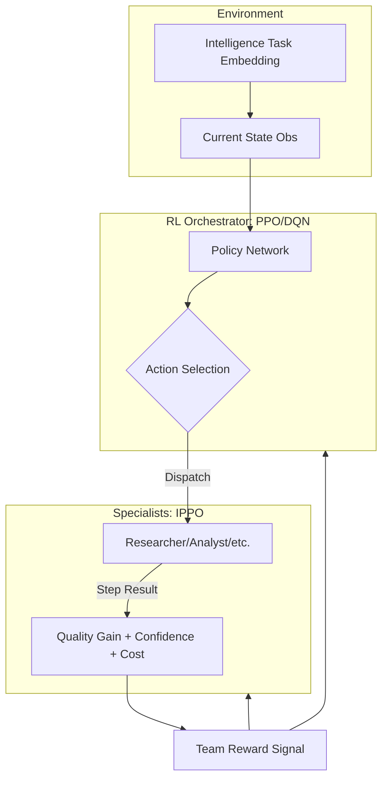

# Technical Documentation: Madison-RL Approach

This document provides a comprehensive technical breakdown of the Reinforcement Learning architecture, experimental design, and algorithmic implementation used in the Madison-RL project.

---

## 1. System Architecture

The project implements a **Hierarchical Orchestration** pattern where a high-level agent (the Orchestrator) manages a pool of low-level specialist agents.

---

## 2. Markov Decision Process (MDP) Specification

### 2.1 State Space (Observation)
The orchestrator receives a **25-dimensional continuous observation vector** $s_t \in \mathbb{R}^{25}$ normalized for stable neural network training:

1.  **Task Semantics (16-d):** High-dimensional task embedding.
2.  **Progress Metrics (3-d):** 
    *   `partial_quality`: $0.0 \to 1.0$.
    *   `normalized_step`: $t / T_{max}$.
    *   `normalized_cost`: $cost\_used / 20.0$.
3.  **Topology (4-d):** Binary mask of specialists already utilized in the current episode.
4.  **Recency Feedback (2-d):** `last_confidence` and `last_quality_gain` from the previous step.

### 2.2 Action Space
The agent operates on a **Discrete(5)** action space:
*   `0-3`: Dispatch Specialist $[i]$.
*   `4`: **FINISH** (Terminal action).

### 2.3 Reward Engineering
The reward function $R(s, a, s')$ is a hybrid of dense shaping and sparse terminal signals:
*   **Dense Shaping:** $r_{dense} = (0.5 \times \Delta Q) - (0.02 \times cost)$. This encourages monotonic quality improvement while penalizing excessive computation.
*   **Sparse Terminal Reward:**
    *   If $Q_{final} \ge Threshold$: $Reward = (10.0 \times Q_{final}) + (1.5 \times Efficiency\_Bonus)$.
    *   If $Q_{final} < Threshold$: $Reward = -2.0$.

---

## 3. Algorithmic Implementations

We evaluate the system across **five categories** of Reinforcement Learning:

### 3.1 Policy Gradient (PPO) 
*   **Implementation:** Stable-Baselines3 PPO.
*   **Network:** `MlpPolicy` [64, 64] with ReLU activations.
*   **Optimization:** 
    *   **GAE (Generalized Advantage Estimation):** $\lambda = 0.95$.
    *   **Entropy Bonus:** $0.01$ (to prevent premature convergence and encourage exploration).
    *   **Clipping Range:** $0.2$.

### 3.2 Value-Based (DQN)
*   **Algorithm:** Deep Q-Network with Experience Replay.
*   **Exploration:** $\epsilon$-greedy decaying from $1.0$ to $0.05$.
*   **Advantage:** Reaches convergence significantly faster than PPO by reusing off-policy data, though final performance is slightly more variable.

### 3.3 Multi-Agent RL (IPPO)
*   **Category:** Cooperative MARL.
*   **Policy:** Independent PPO (IPPO) where specialists learn effort policies.
*   **Shared Reward:** Specialists and the Orchestrator both optimize the **same cumulative team reward**, ensuring alignment of goals.

### 3.4 Exploration (Intrinsic Motivation)
*   **Novelty Bonus:** $r_{intrinsic} = \frac{\beta}{\sqrt{N(task\_bucket, action) + 1}}$.
*   **Effect:** Forces the agent to explore specialist combinations it has rarely tried for specific task types, even if the dense reward hasn't triggered yet.

---

## 4. Simulation Environment (IntelligenceTaskEnv)

To enable fast CPU training, we developed a simulation model of intelligence workflows:
*   **Capability Match:** Quality gain is the dot product of the task's required capabilities and the specialist's expertise.
*   **Diminishing Returns:** Quality gain is scaled by $(1.0 - Current\_Quality)$, making the final 10% of a task the hardest to solve.
*   **Difficulty Scaling:** Tasks have a difficulty parameter $[0, 1]$ which acts as a multiplier on quality gain.

---

## 5. Statistical Rigor

All RL methods are validated using:
*   ** Welch's t-tests:** To prove RL methods outperform non-RL baselines (p-values $< 10^{-20}$).
*   **Cohen's d:** To measure the magnitude of the improvement (Large effect size $> 1.0$).
*   **Bootstrap 95% Confidence Intervals:** Across multiple training seeds to ensure reliability.
