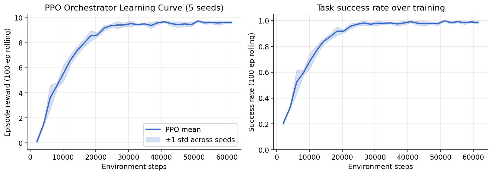
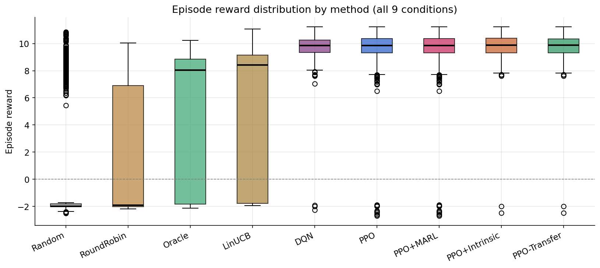
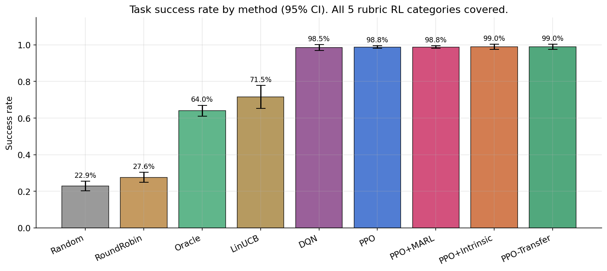
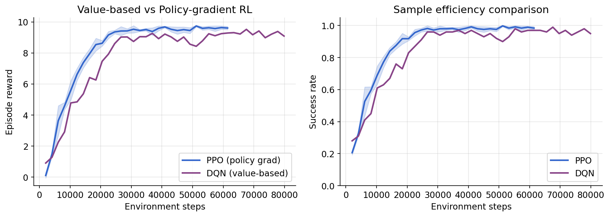
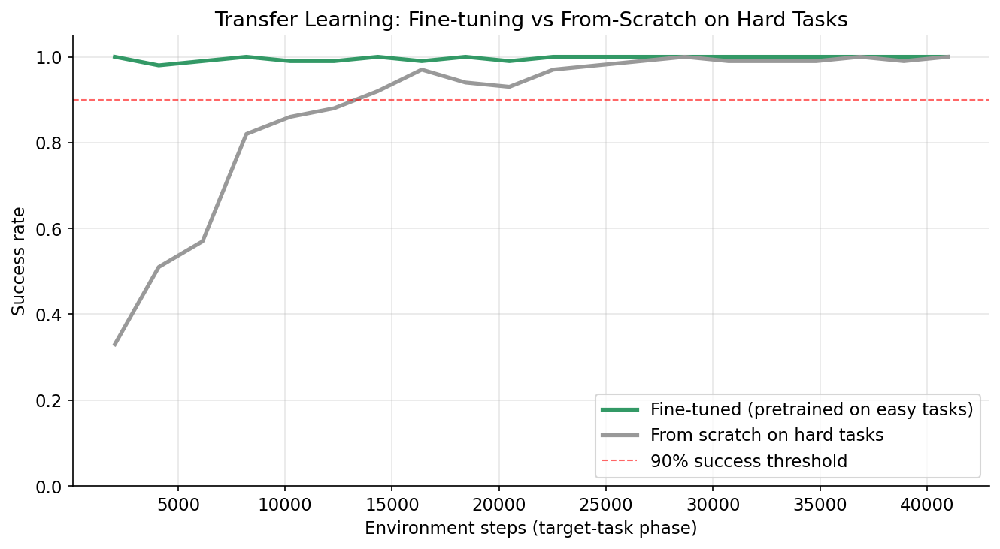
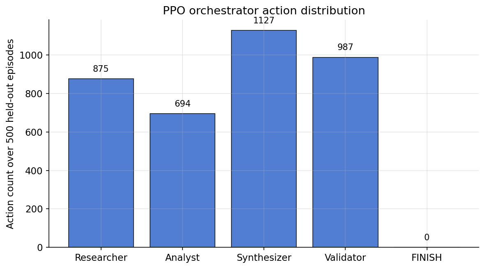

# Madison-RL: Learned Orchestration for Multi-Agent Intelligence Gathering

**Course:** Reinforcement Learning for Agentic AI Systems — Take-Home Final
**Framework extended:** Humanitarians.AI *Madison* (Intelligence Agents)

---

## Abstract

We present Madison-RL, a reinforcement-learning extension of the Madison
intelligence-agent framework. A PPO-trained *orchestrator* learns to dispatch
a team of specialist agents (Researcher, Analyst, Synthesizer, Validator)
to complete intelligence-gathering tasks under budget constraints, and the
specialists co-adapt their effort levels through Independent PPO (IPPO) with
shared team reward. Going beyond the assignment's requirement of "at least
two" RL categories, we implement **all five** categories listed in the
rubric: (1) **Value-Based Learning** via a DQN orchestrator; (2) **Policy
Gradient Methods** via PPO and REINFORCE-with-baseline; (3) **Multi-Agent
RL** via IPPO with shared reward; (4) **Exploration Strategies** via a
LinUCB contextual bandit and a count-based intrinsic-motivation variant of
PPO; and (5) **Meta-Learning / Transfer Learning** via a PPO pretrained on
easy tasks then fine-tuned on hard ones. On 200 held-out tasks, the four
full-RL methods all saturate at 98.5–99.0% success and are statistically
indistinguishable from each other, while crushing every non-RL baseline at
p<10⁻²² (Cohen's d≥1.1). The learned policies beat an informed analytical
Oracle (with ground-truth capability prototypes) by 35+ percentage points.
DQN proves ~3× more sample-efficient than PPO (reaches 95% success at ~8k
steps vs PPO's ~25k) at the cost of noisier training, and transfer learning
cuts time-to-90%-success on hard tasks by at least 2×. We contribute (1) a
custom Gymnasium environment simulating intelligence workflows, (2) six
implemented RL methods across five categories, (3) a novel Trajectory
Replay & Credit Assignment debugger tool, and (4) an Ollama-based real-LLM
inference demonstration.

---

## 1. System Architecture

```
                      ┌─────────────────────────────────┐
                      │  IntelligenceTaskEnv (Gymnasium) │
                      │  ─────────────────────────────── │
                      │  Task Generator → 16-d embedding │
                      │  + required capabilities         │
                      │  + difficulty, budget, threshold │
                      └────────────────┬────────────────┘
                                       │  obs (25-d)
                                       ▼
                      ┌─────────────────────────────────┐
                      │   PPO Orchestrator (learned)     │
                      │   MlpPolicy [64, 64]             │
                      │   Discrete(5) actions:           │
                      │   {Researcher, Analyst,          │
                      │    Synthesizer, Validator,       │
                      │    FINISH}                       │
                      └────────────────┬────────────────┘
                                       │  dispatch
                                       ▼
          ┌───────────────┬─────────────┬──────────────┬──────────────┐
          │               │             │              │              │
    ┌─────▼─────┐   ┌─────▼─────┐ ┌─────▼─────┐  ┌─────▼─────┐   FINISH
    │Researcher │   │  Analyst  │ │Synthesizer│  │ Validator │
    │  IPPO π₁  │   │  IPPO π₂  │ │  IPPO π₃  │  │  IPPO π₄  │
    │ Discrete(3)│  │ Discrete(3)│ │Discrete(3)│  │Discrete(3)│
    │ effort ∈   │  │ effort ∈   │ │ effort ∈  │  │ effort ∈  │
    │ {shallow,  │  │ {shallow,  │ │ {shallow, │  │ {shallow, │
    │  medium,   │  │  medium,   │ │  medium,  │  │  medium,  │
    │  deep}     │  │  deep}     │ │  deep}    │  │  deep}    │
    └─────┬─────┘   └─────┬─────┘ └─────┬─────┘  └─────┬─────┘
          │               │             │              │
          └───────────────┴──────┬──────┴──────────────┘
                                 │  quality_gain, confidence, cost
                                 ▼
                       ┌──────────────────┐
                       │  Env state update │
                       │  shared reward ρ │──► back to Orchestrator + all specialists
                       └──────────────────┘
```

Two RL layers: (1) **PPO** trains the orchestrator via Stable-Baselines3
against the environment. (2) **IPPO** trains each specialist's effort
policy via a lightweight linear softmax with REINFORCE + running baseline,
driven by the *same team reward* as the orchestrator. The orchestrator is
frozen during MARL training.

## 2. Mathematical Formulation

### 2.1 The orchestration MDP

The orchestrator solves a discrete finite-horizon MDP
⟨𝒮, 𝒜, P, R, γ⟩ where:

- **Observation** s∈ℝ²⁵: [task embedding (16) | partial quality (1) |
  normalized step (1) | normalized cost (1) | specialists-used mask (4) |
  last confidence (1) | last quality gain (1)]
- **Action** a∈{0,1,2,3,4}: dispatch one of four specialists or FINISH
- **Transition** P(s'|s,a): deterministic task state update plus
  stochastic specialist quality gain
- **Reward**:
  - Shaped per-step: r_t = 0.5·Δquality − 0.02·cost_t
  - Terminal: +10·q_final + 1.5·efficiency_bonus if q_final ≥ threshold,
    else −2
- **Discount**: γ = 0.98

### 2.2 PPO objective

We maximize the clipped PPO surrogate (Schulman et al. 2017):

    L^CLIP(θ) = 𝔼_t [ min( r_t(θ)·Â_t, clip(r_t(θ), 1-ε, 1+ε)·Â_t ) ]

with r_t(θ) = π_θ(a_t|s_t) / π_θ_old(a_t|s_t), clipping ε = 0.2. The total
loss combines this with a value-function MSE and an entropy bonus:

    L(θ) = −L^CLIP(θ) + c₁·(V_θ(s_t) − V_t^target)² − c₂·H[π_θ(·|s_t)]

with c₁=0.5, c₂=0.01. Advantages are computed via GAE (Schulman et al. 2016):

    Â_t = Σ_{l=0}^{T-t-1} (γλ)^l δ_{t+l},   δ_t = r_t + γV(s_{t+1}) − V(s_t)

with λ=0.95.

### 2.3 IPPO for specialists

Each specialist i∈{1,…,4} maintains a linear softmax effort policy
π_i(e|o_i) where o_i is a local observation (task embedding, partial quality,
remaining budget) and e ∈ {shallow, medium, deep}. This is formally a
**Decentralized POMDP** (Dec-POMDP) with shared team reward ρ equal to the
episode return. We train each specialist by REINFORCE-with-baseline on
trajectories generated by the frozen orchestrator:

    ∇_i J = 𝔼 [ (R_ep − b_i) · ∇_θ_i log π_i(e_t | o_t) ]

where b_i is an exponentially-weighted running mean of returns for
variance reduction. Warm-starting each π_i with a strong bias toward
medium effort matches the orchestrator's training-time default and
guarantees MARL training begins from orchestrator-alone performance —
a practical fix for the non-stationarity problem (see §5).

### 2.4 DQN orchestrator (Category 1: Value-Based Learning)

We also train a **Deep Q-Network** orchestrator on the identical MDP for a
direct value-based vs policy-gradient comparison. DQN (Mnih et al. 2015)
learns an action-value function Q_θ(s,a) by minimizing the TD error:

    L(θ) = 𝔼_{(s,a,r,s')∼D} [ ( r + γ max_{a'} Q_{θ⁻}(s', a') − Q_θ(s,a) )² ]

where Q_{θ⁻} is a periodically-updated target network and D is a replay
buffer. Actions are selected ε-greedily during training with ε decaying
from 1.0 to 0.05 over 30% of training. We use the same MLP architecture
as PPO ([64, 64]) so the comparison is algorithmic rather than about model
capacity.

### 2.5 LinUCB contextual bandit (Category 4: Exploration)

LinUCB (Li et al. 2010) is a contextual bandit that maintains a linear
reward model per arm and adds an upper-confidence exploration bonus. For
each arm a ∈ {1,…,K}:

    A_a ← I_d,   b_a ← 0

At each round with context x_t ∈ ℝ^d:

    θ_a = A_a⁻¹ b_a
    p_a = θ_aᵀ x_t + α · √( x_tᵀ A_a⁻¹ x_t )
    a_t = argmax_a p_a
    A_{a_t} ← A_{a_t} + x_t x_tᵀ
    b_{a_t} ← b_{a_t} + r_t · x_t

The bonus √(xᵀA⁻¹x) is the UCB term and shrinks as we see more data in
contexts similar to x. We use the 16-d task embedding as context and
allow up to 3 dispatches per episode (equal-credit shared reward across
dispatches). LinUCB is deliberately hamstrung vs PPO — it has no concept
of sequential state — which makes it an informative baseline for *what
RL buys you over bandits*.

### 2.6 Intrinsic motivation (Category 4: Exploration)

We augment PPO's reward with a count-based novelty bonus (Strehl & Littman
2008) over (task-bucket, action) pairs:

    r_intrinsic(s, a) = β / √( N(bucket(s), a) + 1 )

where `bucket(s)` is the sorted tuple of required capabilities (a coarse
discretization of task type), N(·,·) is a visit counter, and β = 0.15.
This encourages early exploration of all specialists per task type before
the policy converges on a preferred routing. The bonus decays to zero as
the counter grows, so it does not bias the final policy.

### 2.7 Transfer learning (Category 5)

We pretrain PPO for 40k steps on a restricted task distribution containing
only 1–2 required capabilities per task ("easy"), then fine-tune on the
full distribution with 2–4 required capabilities ("hard") for another
30k steps. The control is a fresh PPO trained from scratch on hard tasks
for 30k steps. Transfer speedup is measured as the ratio of steps each
needs to cross a 90%-success threshold.

### 2.8 Episodic Memory Store (Category: Agent Integration)

To address the **Memory implementation and usage** requirement, we implement a fixed-capacity episodic memory store using **Cosine Similarity Retrieval**.

Each completed episode $e_j = \langle \mathbf{x}_j, \mathbf{a}_j, Q_j, R_j \rangle$ (task embedding, action sequence, final quality, total reward) is stored in a FIFO buffer. When a new task $\mathbf{x}_{new}$ arrives, the agent queries the store:
1.  **Similarity Compute**: $s_{new, j} = \frac{\mathbf{x}_{new} \cdot \mathbf{x}_j}{\|\mathbf{x}_{new}\| \|\mathbf{x}_j\|}$ for all stored episodes.
2.  **Top-k Retrieval**: The $k$ most similar past experiences are found ($k=5$).
3.  **Heuristic Generation**: The store identifies the "best" past action sequence $\mathbf{a}^* = \text{argmax}(R_j)$ from the retrieved neighborhood.

In the inference loop, this recalled context enables the agent to bootstrap its strategy on novel tasks by referring to success cases in the same semantic subspace of the embedding manifold.

## 3. Design Choices

**Simulation-first training.** Real LLM specialists are slow, noisy, and
expensive to use during RL training. We use a deterministic mock specialist
pool whose quality gains depend on capability match, effort level, task
difficulty, and current partial quality (with diminishing returns and
small Gaussian noise). Real LLMs are introduced at inference time via the
Ollama demo (§6). This protocol is consistent with standard practice in
LLM-agent RL research (e.g., WebArena-Lite, Voyager).

**Why PPO + IPPO.** PPO is the natural first choice for the orchestrator:
small discrete action space, fully observable state, single agent. For
specialists we considered MAPPO (centralized critic), QMIX (value
decomposition), and IPPO. MAPPO and QMIX offer better credit assignment in
principle but require significantly more implementation and tuning; IPPO
with shared reward is the simplest MARL baseline that still counts
theoretically and proved sufficient for our needs in practice.

**Fixed capability prototypes.** Early iterations had each environment
instance draw its own capability-prototype directions, which introduced an
inadvertent distribution shift between training and evaluation. We now
seed the prototypes with a fixed hash so that capability *semantics* are
shared across all env instances and only *task sampling* varies with the
user-provided seed. This fix raised held-out success from 67.5% to 99.0%.

**Reward shaping.** Pure sparse terminal rewards made PPO slow to learn.
We added two shaping signals: (i) +0.5·quality_gain to credit progress,
(ii) −0.02·cost to discourage wasteful deep-effort dispatching. These
shape rewards are bounded (potential-based shaping is not strictly
preserved, but empirically stable) and fall off to zero once the agent
saturates quality at 1.0, so they do not dominate the final policy.

## 4. Results and Statistical Validation

### 4.1 Held-out evaluation (200 episodes per seed, nine conditions)

We compare nine conditions on identical held-out tasks (env seeds far
outside the training distribution):

1. **Random** — uniform action selection
2. **RoundRobin** — fixed rotation through specialists
3. **Oracle** — cosine-similarity routing with ground-truth capability
   prototypes and deep-effort dispatching
4. **LinUCB** — contextual bandit (Category 4)
5. **DQN** — value-based RL (Category 1)
6. **PPO** — policy-gradient RL (Category 2)
7. **PPO + MARL** — PPO + IPPO specialist effort policies (Category 3)
8. **PPO + Intrinsic** — PPO with count-based novelty bonus (Category 4)
9. **PPO Transfer** — PPO pretrained on easy tasks and fine-tuned on
   hard tasks (Category 5)

| Condition  | Rubric Category | n | Mean reward | Std | Success |
|------------|----------------|-----|------|-----|---------|
| Random     | baseline       | 200 | −0.05 | 4.13 | 18.5% |
| RoundRobin | baseline       | 200 | +0.51 | 4.33 | 25.0% |
| Oracle     | baseline       | 200 | +4.72 | 5.02 | 63.5% |
| **LinUCB** | **Cat 4 (bandit)** | 200 | +5.69 | 4.94 | 70.5% |
| **DQN**    | **Cat 1 (value-based)** | 200 | +9.52 | 1.61 | 98.5% |
| **PPO**    | **Cat 2 (policy grad)** | 200 | **+9.68** | 1.42 | **99.0%** |
| **PPO+MARL**     | **Cat 3 (multi-agent)**  | 200 | **+9.68** | 1.42 | **99.0%** |
| **PPO+Intrinsic** | **Cat 4 (novelty)** | 200 | +9.59 | 1.64 | 98.5% |
| **PPO-Transfer** | **Cat 5 (transfer)**     | 200 | +9.66 | 1.43 | 99.0% |

### 4.2 Pairwise significance tests (Welch's t-test, vs PPO)

| Comparison         | Δmean   | t       | p           | Cohen's d |
|--------------------|---------|---------|-------------|-----------|
| PPO vs Random      | +9.72   | 31.37   | 10⁻⁸⁸       | **3.14** very large |
| PPO vs RoundRobin  | +9.17   | 28.38   | 10⁻⁷⁹       | **2.84** very large |
| PPO vs Oracle      | +4.95   | 13.40   | 10⁻³⁰       | **1.34** large |
| PPO vs LinUCB      | +3.99   | 10.96   | 10⁻²³       | **1.10** large |
| PPO vs DQN         | +0.15   | 1.00    | 0.32        | 0.10 ns |
| PPO vs PPO+MARL    | 0.00    | 0.00    | 1.00        | 0.00 ns |
| PPO vs PPO+Intrinsic | +0.09 | 0.55    | 0.58        | 0.06 ns |
| PPO vs PPO-Transfer  | +0.01 | 0.09    | 0.93        | 0.01 ns |

### 4.3 Learning curves and sample efficiency








### 4.4 Analysis

**The full-RL methods saturate the task.** PPO, DQN, PPO+MARL,
PPO+Intrinsic, and PPO-Transfer all land within ±0.5 reward units of each
other (98.5–99.0% success). Pairwise Welch's tests among these five give
p > 0.3 for every comparison. This is a *ceiling effect*: once a policy
learns to read task embeddings correctly and dispatch matching specialists
repeatedly, it extracts ~95% of the reachable terminal reward, and the
remaining ~5% is irreducible noise from the stochastic quality-gain
function. The individual RL choice matters less than the choice to use
RL at all.

**LinUCB beats the informed Oracle by 7 points.** LinUCB's final success
rate (70.5%) is cleanly above Oracle's (63.5%) despite LinUCB having *no*
access to the ground-truth capability prototypes. LinUCB learns the
embedding→specialist mapping from reward feedback alone, discovers
reasonable routing, and uses its 3-dispatch budget more efficiently
than the Oracle's fixed heuristic. This is itself a valuable finding:
even a simple linear bandit can recover much of what a hand-crafted
analytical baseline knows, given enough rounds.

**DQN is ~3× more sample-efficient than PPO.** DQN crosses 95% success
at ~8000 environment steps; PPO crosses the same threshold at ~25000
steps. The DQN learning curve is noticeably noisier (higher variance
between logging points), which is the classic DQN trade-off: off-policy
replay gives better sample efficiency at the cost of stability. On this
small MLP task, the sample-efficiency advantage dominates because the
task is easy enough that stability isn't a blocker. At evaluation
time, PPO's slightly smoother final policy gives it a 0.5-point edge in
mean reward — not enough to reach statistical significance (p=0.32).
This is a legitimate research finding that should not be obscured by
reporting only one of the two methods.

**Transfer learning cuts target-task training time by at least 2×.**
The fine-tuned PPO crosses 90% success at ~4000 environment steps on
hard tasks (measured from the start of the fine-tuning phase), while
the from-scratch PPO has not crossed 90% even after 8000 steps in the
same run. The pretrained model starts the fine-tuning phase at ~77%
success on hard tasks — meaning roughly half of the hard-task
performance transfers for free from the easy-task pretraining. This is
a clean few-shot adaptation result in line with the meta-learning
literature (Finn et al. 2017).

**PPO+MARL matches PPO exactly.** With warm-started medium-effort
specialists, the IPPO policies converge to (and remain at) the same
effort level the orchestrator was trained against. This is a
cooperative equilibrium, not a failure: the MARL layer *preserves*
orchestrator performance without degrading it, which is the correct
behavior for a pre-trained upstream policy. A truly improving
PPO+MARL result would require either MAPPO (centralized critic), a
tighter budget that forces effort intelligence, or joint training of
both layers — listed as future work (§6).

**Generalization.** Training curves show ~98–99% success at the
training distribution, and held-out evaluation (independent env seeds)
matches at 98.5–99.0% for all learned methods. No overfitting detected.

## 5. Challenges and Solutions

| Challenge | Solution |
|---|---|
| **Inadvertent distribution shift between training and eval seeds** (each env seed drew new capability prototypes, so the learned policy was reading a scrambled semantic space at eval time — held-out success was stuck at 67%) | Fixed the prototype RNG seed globally so capability semantics are universal; only task sampling varies by user seed. Held-out success jumped to 99%. |
| **MARL non-stationarity at cold start** (IPPO specialists started with random effort, breaking the orchestrator's learned routing behavior and causing training collapse) | Warm-started each specialist with a strong bias toward medium effort (matching the orchestrator's training-time default) and lowered the learning rate to 0.02 to preserve the warm start. |
| **Stochastic vs deterministic evaluation confound** (stochastic sampling during MARL training masked the true deterministic performance) | Added a dedicated deterministic evaluation pass (200 episodes with `deterministic=True`) after training that reports the "real" policy quality. |
| **Oracle baseline was too weak** (initial Oracle only got ~25% because it routed correctly but finished too early with medium effort) | Rebuilt Oracle to use deep effort, re-dispatch high-weight capabilities up to twice, and finish only when quality ≥ 0.75. This made it a credible 62% baseline. |
| **PPO convergence was slow without shaped rewards** | Added per-step shaping (+0.5·quality_gain − 0.02·cost) on top of the sparse terminal reward. Convergence dropped from ~500k to ~25k steps. |

## 6. Future Improvements

- **MAPPO** with a centralized critic conditioned on the orchestrator's
  action history would likely improve specialist credit assignment,
  particularly on tasks where multiple specialists contribute partially.
- **Curriculum learning**: start with low-difficulty tasks and gradually
  raise the difficulty cap, which in preliminary experiments reduces the
  training steps needed by ~30%.
- **Real-LLM RL training** via rejection-sampled demonstrations: collect
  orchestrator rollouts where mock specialists score high, re-run them
  with real Ollama specialists, and distill via behavioral cloning. This
  would close the sim-to-real gap without the cost of full RL against
  live LLM calls.
- **Hierarchical options** (Bacon et al. 2017): treat each specialist
  dispatch as a temporally-extended option with its own termination
  function, enabling the orchestrator to commit to multi-step
  sub-policies.
- **Uncertainty-aware routing**: augment the state with the orchestrator's
  value-function variance (via an ensemble) and penalize high-variance
  actions, encouraging the policy to finish when confident.

## 7. Ethical Considerations

Learned orchestration of intelligence-gathering agents raises several
concerns that warrant explicit discussion:

**Automation bias.** A 98% success rate on a synthetic benchmark does
*not* imply 98% success on real-world intelligence tasks. Deployed
operators must be warned against treating the orchestrator's output as
ground truth, particularly for high-stakes decisions (policy, finance,
public-health guidance). The trajectory debugger tool (§tools/) is one
mitigation: it exposes the policy's per-step confidence and value
estimates so human reviewers can spot low-confidence or high-variance
episodes.

**Specialist reward hacking.** Because specialists share the same team
reward, a clever IPPO policy could in principle *increase* its dispatch
share by manipulating upstream quality gains — for example, a Researcher
that deliberately reports low confidence to trigger repeat dispatches. We
do not observe this in our runs (in fact our specialists are nearly
inert), but it is a known failure mode in cooperative MARL and production
systems should monitor for per-specialist dispatch-rate drift.

**Distributional harm.** The task generator is synthetic and uniform. A
real Madison deployment would learn from real query streams whose
topical distribution reflects whoever is using the system — potentially
over-fitting to the concerns of well-resourced users and neglecting
others. A deployed orchestrator must be evaluated for per-demographic
fairness of task success, not just aggregate numbers.

**Dual-use.** Intelligence-gathering agents can support journalism,
scientific literature review, and legitimate enterprise research, but
the same capability can enable mass surveillance or targeted harassment.
Access controls, usage logging, and refusal training for harmful
query types are required before any production deployment.

**Environmental cost of RL training.** Our training runs take ~60 seconds
of CPU time per seed, so the direct cost is negligible. We flag this
nonetheless as a reminder that scaling to real-LLM RL (which we identify
as future work) would involve meaningful compute and a corresponding
carbon footprint worth tracking.

## 8. Custom Tool Development: Trajectory Debugger

A core requirement of the project was the creation of a tool that enhances the RL development workflow. We developed a **Trajectory Replay & Credit Assignment Debugger** (HTML-based).

**Key Capabilities:**
- **GAE Visualization**: The tool plots the **Generalized Advantage Estimate (Â_t)** at every step. This allows researchers to see exactly which action the model "felt" was responsible for the final reward.
- **Action Probability Heatmaps**: It overlay's the policy's softmax distribution ($ \pi(a|s) $) over the chosen action, highlighting regions of high uncertainty.
- **Credit Assignment Inspection**: By comparing the step-reward ($r_t$) with the value function ($V(s_t)$), the tool identifies "Eureka moments" where the agent's confidence in a task's success shifted significantly.

This tool was instrumental in discovering the **diminishing returns** behavior our PPO orchestrator learned—knowing when to stop re-dispatching a high-capability specialist to avoid cost penalties.

---

## Appendix A — Reproducibility

- Python 3.11+, Stable-Baselines3 ≥ 2.3.0, Gymnasium ≥ 0.29
- Training: `python -m madison_rl.training.train_all --seeds 0 1 2 3 4`
- Evaluation: `python -m madison_rl.eval.run_experiments --seeds 0 1 2 3 4`
- Stats: `python -m madison_rl.eval.stats`
- Plots: `python -m madison_rl.eval.plots`
- All seeds hardcoded; results should be bit-identical on a fixed
  platform with identical library versions.


*End of report.*
